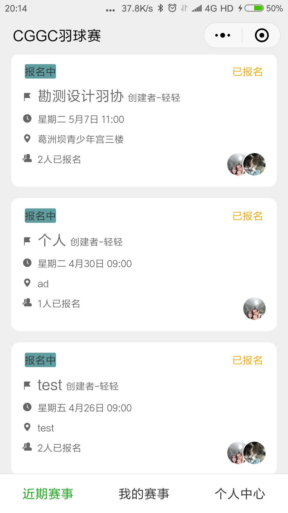
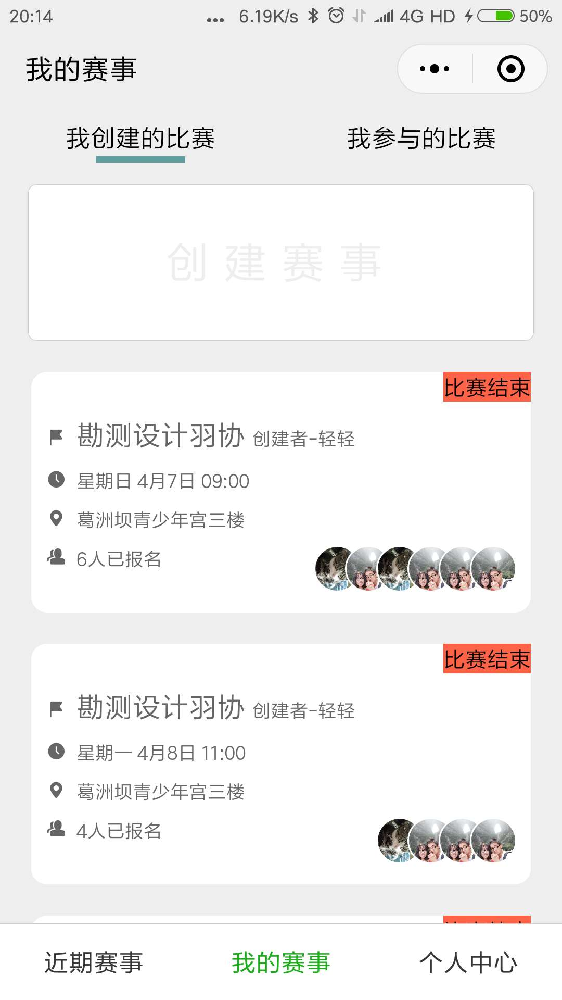
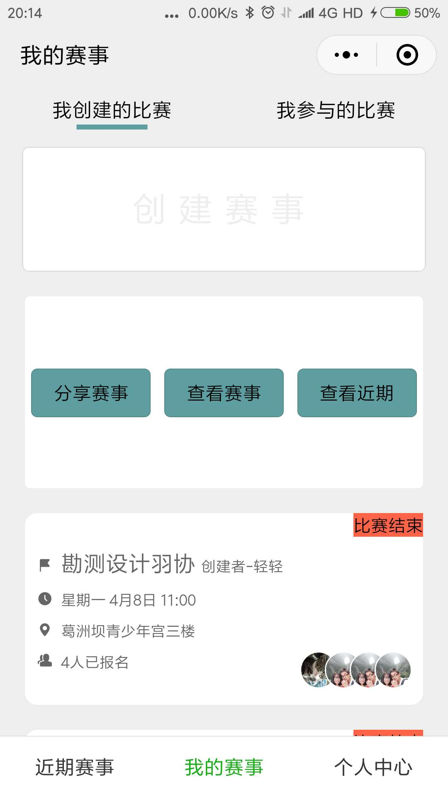
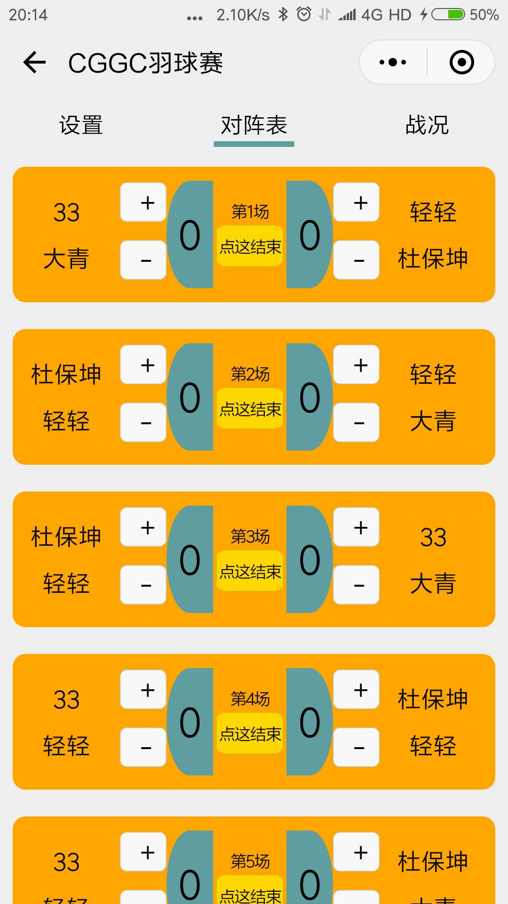
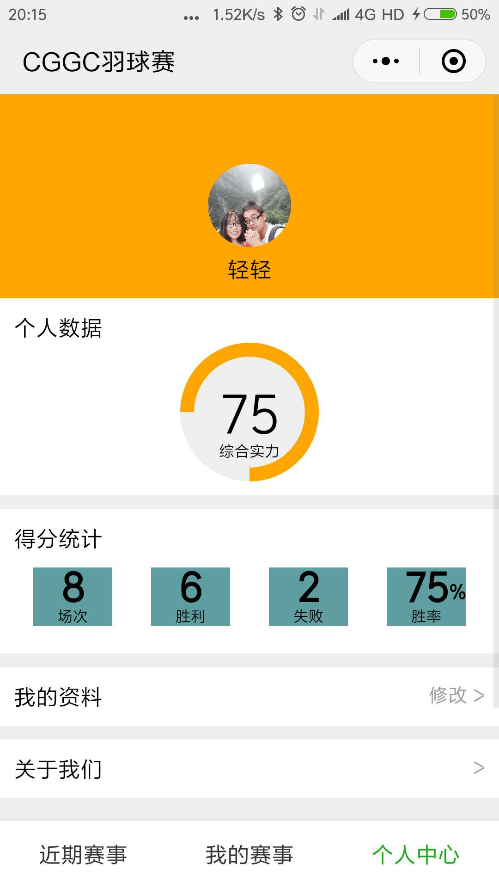
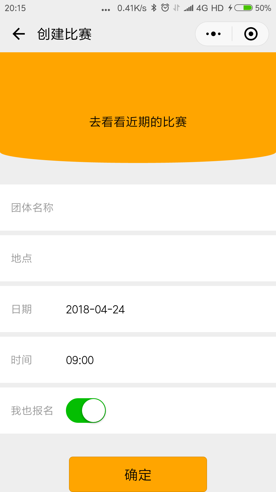
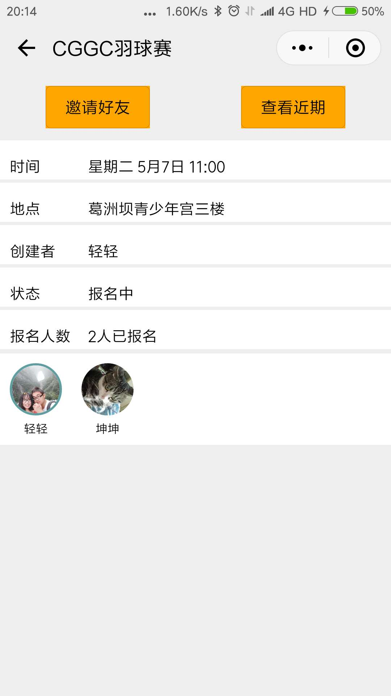

# 羽球自由赛
采用微信小程序 wepy框架编写       实现了业余羽毛球爱好者 组织团体赛的一系列功能 包括创建、报名、邀请好友、生成对阵方案、计分、统计排名等功能 
## 关键技术问题
* 父子组件通信
* 页面间通信
* 翻牌动画
* 圆形进度条实现
## 遇到的一些坑
* 使用wepy框架 务必将开发者工具中 关闭关闭ES6转ES5 关闭上传代码时样式自动补全 关闭代码压缩上传
* 标签闭合不正确 经常会导致 找不到页面 File not found: ./../../components/matchActive.wxss一般问题出在他本身或者他所引用的组件的标签没有闭合 导致 解析文件css 或者 js出错
* 父子组件动态传参 传参方和受参方 设置一定要注意，type写错 可能会收不到参数 而报错 如 Right-hand side of 'instanceof' is not an object
* 同一个组件 被多次引用 组件中的Data是共用的，一个引用的地方改变了他 会影响到其他组件，所以要想私有化 可以通过props 或者 引用的时候起个别名 实现
* 组件引用错误 或者引用没有被定义的组件 可能会报错 如下 unexpected attribute name, near `.sync`
* 尽量少用watch 比较容易出现没有按照预期更改的现象 尤其是当出现循环引用 的时候，另外 watch中改变组件Data后 要用this.$apply()使其生效
* 异步函数中 改变Data this.$apply()使其生效
* 路由栈 只是针对单个的tabBar的 拿不到其他tab的栈信息
* 生命周期是个需要慢慢琢磨的东西
## 运行程序
 克隆到本地 然后进入本地文件
* npm install wepy-cli -g（如果之前安装过 请忽略）
* npm install
* wepy build -w
* 将生成的dist 文件添加到微信开发者工具的项目中
* do what you want you to
## 效果展示
##### 首页
>>>>>
##### 我的赛事（翻转动画）
>>>>> 
##### 比赛详情
>>>>> 
##### 个人主页
>>>>>
#####  创建赛事
>>>>>
##### 分享赛事/邀请参赛
>>>>>
